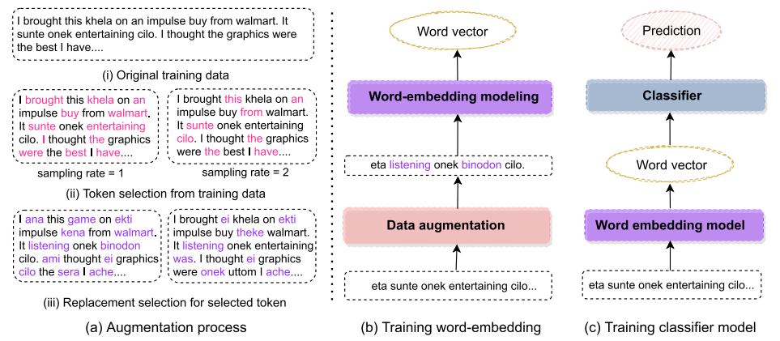

## Data-Augmentation for Bangla-English Code-Mixed Sentiment Analysis: Enhancing Cross-Linguistic Contextual Understanding

This code is the official implementation of the following paper:
* Mohammad Tareq, Md Fokhrul Islam, Swakshar Deb, Sejuti Rahman, Abdullah Al Mahmud, "[Data-augmentation for Bangla-English Code-Mixed Sentiment Analysis: Enhancing Cross Linguistic Contextual Understanding](https://ieeexplore.ieee.org/abstract/document/10129187)," in IEEE Access, 2023.


Figure 1: Distinct languages are represented by different colors (<font color="blue"> blue </font>: English, <font color="brown"> brown </font>: Bangla, <font color="green"> green </font>: transliterated Bangla) in a shared semantic space for CM sentiment classification. (*Left*) Previous studies have used existing monolingual word embeddings for CM sentiment analysis, and therefore, words from different languages cannot be related. (*Right*) When the proposed data augmentation is paired with existing word embeddings, cross-lingual understanding is developed, which improves CM sentiment classification performance.



Figure 2: (a) Proposed data augmentation process with multiple sampling rates. For simplicity, we only showed sampling rate 1 and 2 in the above diagram. (b) Illustration of word embedding training process. We augment input data with several sampling rate. (c) Training the classifier using learned word embedding.
## Dataset descriptions

* `Dictionary_BN_EN_61208.xlsx`: Dictionary of collected word from different sources. Here we made huge dictionary which contain code-mixed bangla word and their english counter word.
* `final_code_mixed_BN_app_review_dataset_csv.xlsx`: The large collectd dataset on code mixed sentiment analysis.

## Running instructions

To run the baseling model with our proposed data augmentation strategy, first, train the word embedding modeling such as Fastext or W2V. For example, to train the fastext word embedding with our proposed data augmentation, run this command
```shell
python align/fastext_align.py
``` 
This will save the word embedding model named as "saved_model_fastex_mask_banglish_supervised". Second, load this model to Conv1DLSTM.py and ml_method.py file to obtain the results for Con1DLSTM and other ML algorithms.

```shell
python align/Conv1DLSTM.py
python align/ml_method.py
``` 

Similarly, to run the baseling model without the data augmentation strategy follow this shell command

```shell
python non-align/fastext_mono.py
python non-align/Conv1DLSTM.py
python non-align/ml_method.py 
```

## Citation
If you use this code and the dataset for your research, please consider to cite our paper:

```
@article{tareq2023data,
  author={Tareq, Mohammad and Islam, Md. Fokhrul and Deb, Swakshar and Rahman, Sejuti and Mahmud, Abdullah Al},
  journal={IEEE Access}, 
  title={Data-Augmentation for Bangla-English Code-Mixed Sentiment Analysis: Enhancing Cross Linguistic Contextual Understanding}, 
  year={2023},
  volume={11},
  number={},
  pages={51657-51671},
  doi={10.1109/ACCESS.2023.3277787}
}
  ```
## Contact
For any question, feel free to contact @
```
Swakshar Deb     : swakshar.sd@gmail.com
Md Fokhrul Islam : fokhrul.rmedu@gmail.com
```
